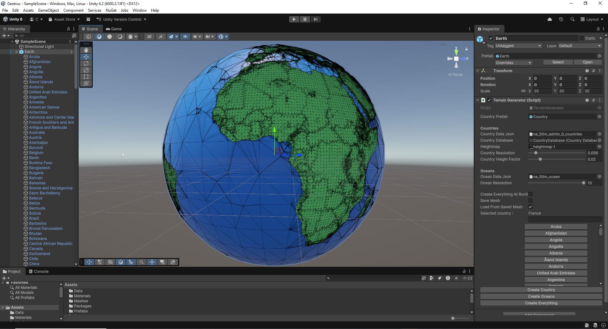
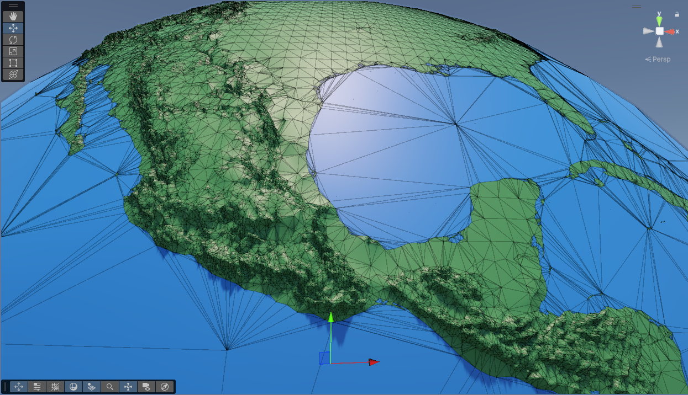

# Geotruc

Génèration et visualisation d'un modèle 3D de la Terre avec les reliefs selon des données réelles avec optimisation des maillages.

Source des données : 
- Natural Earth : https://github.com/nvkelso/natural-earth-vector/tree/master
- Blue Marble : https://science.nasa.gov/earth/earth-observatory/blue-marble-next-generation/topography-bathymetry-maps/ 

